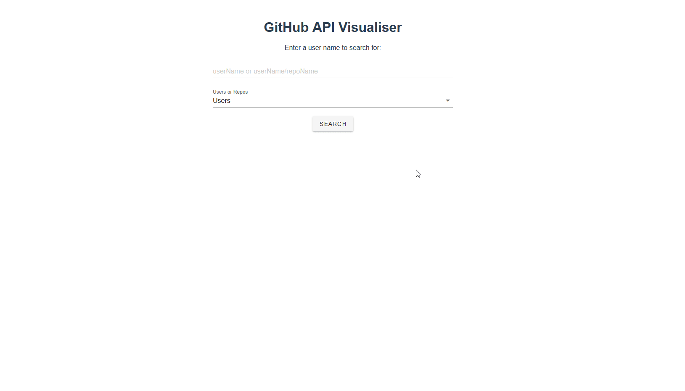
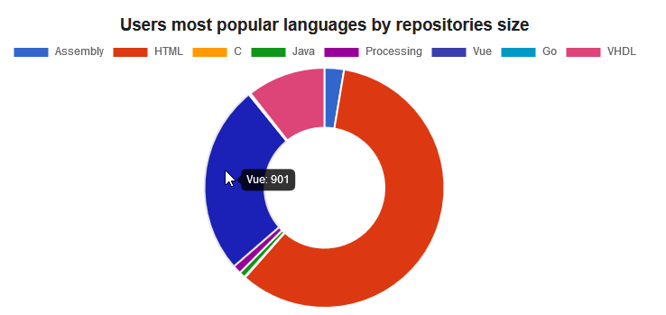

# GitHub-Metric-Visualisation-Project
This is a project built for my CSU33021 that visualises some data about a inputted users GitHub account.

# Running this Project
In the Dockerfile add your personal GitHub API key to the following line:
> ENV VUE_APP_API_KEY <INSERT_YOUR_PERSONAL_ACCESS_TOKEN_HERE> 

Then open a terminal and enter the following:

> docker build -t <your_image_name> .

> docker run -it -p 8080:8080 --rm <your_image_name>

# Overview 
## Search Bar
The search bar provides the ability to search for either a users account or a specific repository.
The top input box accepts an input from the user.
The drop-down menu is used to specifiy if you are looking for a User or a Repository.

## User Page

If a valid username is inputed and the "Users" drop-down is selected you will be taken to the user page,  here you will see various graphs about the user you searched for. 

The first information presented is the userName and Avatar of the user, as well as a card of some of their GitHub stats.

The GitHub stats card displays some basic information about the user as well as a grade based on their stats vs all other users.

The next metric is a calendar of the Users commits in the past 12 months. This calendar contains squares which are a darker shade of green depending on the number of commits made on the day. On hover it displays the exact number of commits made on that day.

This is a graph of all of the users followers and all of their followers followers, followers of first degree are connected with a red line while second degree connections are random colours.

The Pie Chart displays the users most used languages based on the size of all of their repositories in bytes

The two bar charts represent the users top languages based on two metrics

The first in the number of repositories in that language

The second is the number of commits in that language

The final graph on the userPage is a scatter plot of what times the user is active

the X-Axis shows the time of day from midnight to 11:59:59pm and the Y-Axis represents the days of the week labeled 0-6

## Repository Page

This page shows when a user inputs a specific repository to view. Searches must include the username of the repositories owner

The main data displayed on this page is the graph of commits over time. This shows all commits to the repository by all contributors over time.

This Bar Chart shows the total commits of the top contributors.

The pie chart displays the same data but in a more interactive way. You can disable certain users by clicking their name and the chart will update to exclude them.
 

The top users section displays data about the Top Three Contributors to the repo.
It displays their name and profile picture as well as two representations of their commits, a static bar chart and dynamic pie chart

